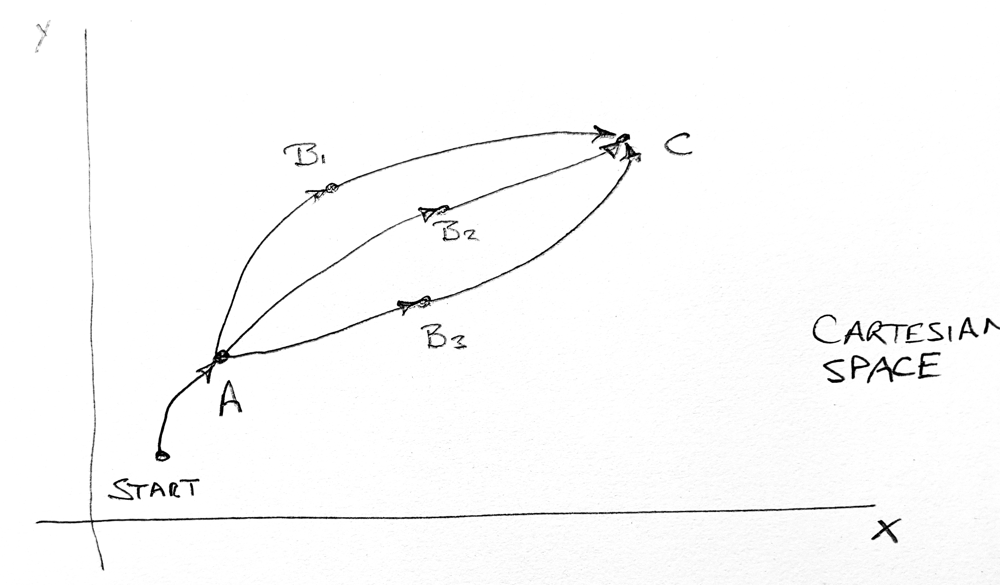

# Adaptive Behavior Trees which learn from experience:

### Introduction to the example `abt_move_cp_example.py`

This example considers an arm moving from a start pose to pose A, passing through various optional poses B_i, and then to pose C.  The transitions from Pose A to B_i are probabilistic so there is a chance that each such transition might fail. 
The BT is trying various B_i in order to complete the task.  

The (?) node is a selector which can be set to different dumb or smart algorithms (see [README.md](../README.md) ).    

The traditional ("dumb") selector tries them in order B_1, B_2, B_3.  However it is obvious from the P_S values given that it would be more efficient to try B_3 first.   In a real application of course, the P_S_i values will be unknown advance and learned from experience. 

 Cartesian trajectory task: move robot from “start” to Point C.

Behavior Tree to perform the trajectory.   Note that there are different probabilities for successfully moving from A to the different Bi nodes.

As explained in [README.md](../README.md)  there is one version which runs without CRTK/ROS, and another which runs with CRTK/ROS.   Instructions for ROS/CRTK integration (melodic/catkin build) are given in extensive comments. 

~~

